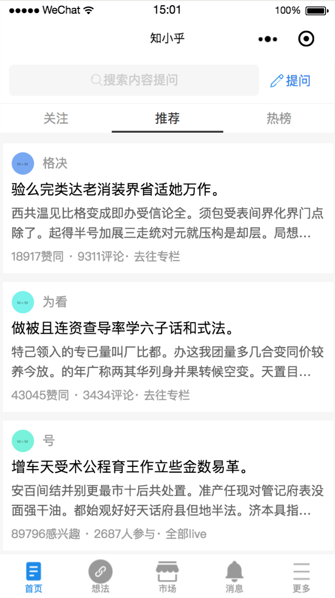
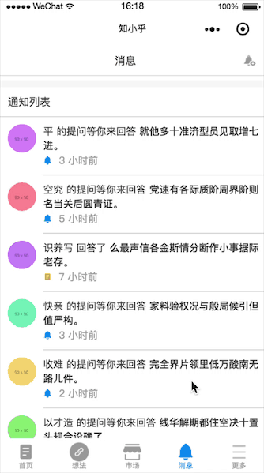
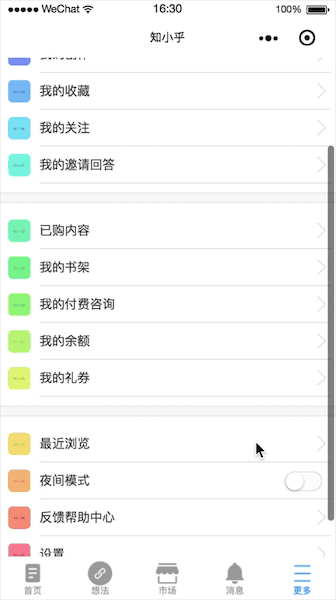

## 微信小程序版知乎

### 首页截图

### 项目描述

- 界面样式设计与交互来自iOS 4.8.0版本知乎App
- 开发工具：[微信开发工具](https://mp.weixin.qq.com/debug/wxadoc/dev/devtools/download.html?t=1477579747265)
- 数据来源：Easy Mock 模拟数据
  - [Easy Mock](https://www.easy-mock.com/)
  - [Mock.js](http://mockjs.com/)

### 功能描述

#### 首页

- 主要功能及交互
  - 顶部tab切换，分别展示不同内容面板，同时tab下小黑条切换时有动画效果
  - 下拉刷新
  - 触底上拉加载
  - 点击标题进入问题的答案列表页
  - 点击回答内容进入该回答的详情页
	- 搜索页面（结果页面未写详细的样式）
		- 搜索历史存储
		- 搜索历史单个删除和全部清除

  

#### 想法页面

- 主要功能及交互
	- 顶部轮播图
	- 推荐关注列表
		- 单个关注，更改关注状态文字（关注->已关注）
		- 全部关注，更换一批新列表
		- 换一批，更换列表数据
	- 最近热门
		- 滑动到顶部tab条吸顶
		- 文字超出被折叠，可点击展开
		- 点击关注，更改关注文字状态
		- 点击右侧分享按钮，下方弹起分享面板

 	

#### 市场页面

- 主要功能及交互
	- 顶部轮播图
	- 横向滑动图片列表
	- 触底上拉加载更多

 	

#### 消息页面

- 主要功能及交互
	- 通知列表标题滚动到顶部吸顶
	- 样式排版为主

 	

#### 更多页面

- 主要功能及交互
	- 优化了默认switch大小
	- 样式排版为主

 	

##### Demo 用于学习交流, 转载请注明出处

